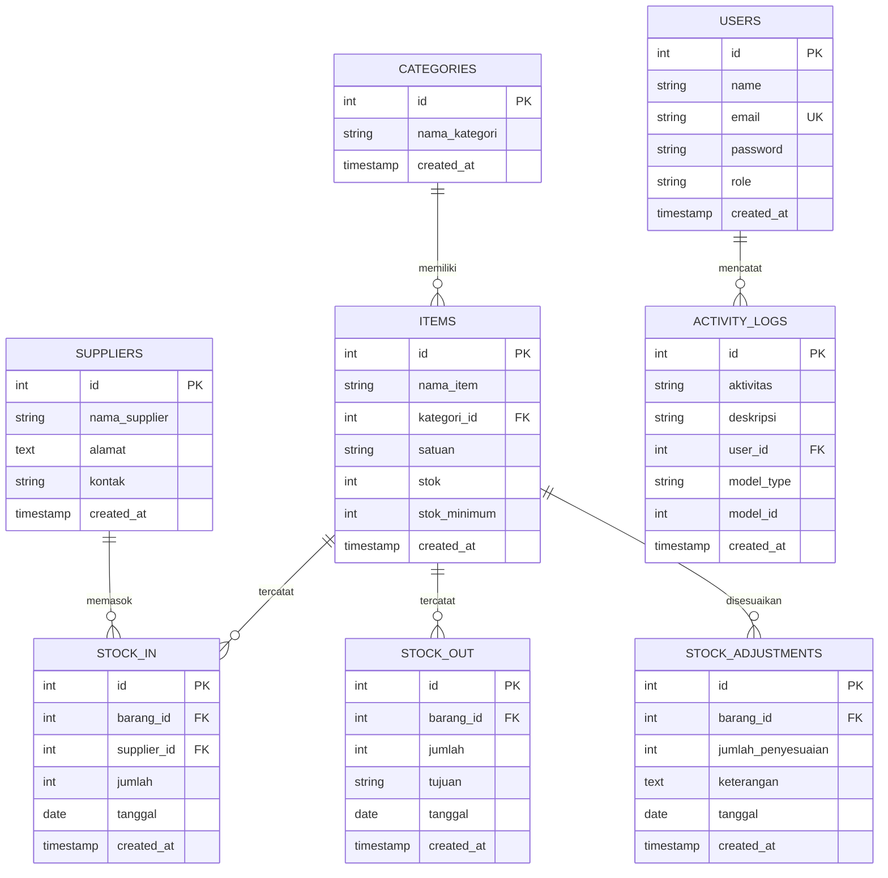
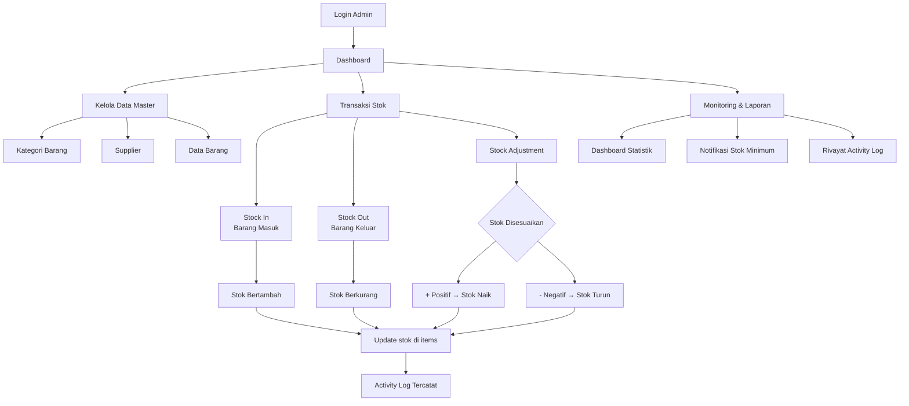

<div align="center">

# ☕ Inventory Cafe Management System

**Aplikasi Manajemen Inventaris Kafe berbasis Laravel**

[](https://laravel.com)
[](https://php.net)
[](https://mysql.com)
[](https://getbootstrap.com)
[](https://chartjs.org)

</div>

---

## 📋 Daftar Isi

- [Deskripsi](#-deskripsi)
- [Fitur Utama](#-fitur-utama)
- [Tech Stack](#-tech-stack)
- [Struktur Database](#-struktur-database)
- [Instalasi](#-instalasi)
- [Konfigurasi Environment](#-konfigurasi-environment)
- [Migrasi dan Seeder](#-migrasi-dan-seeder)
- [Menjalankan Project](#-menjalankan-project)
- [Testing](#-testing)
- [Screenshot](#-screenshot)
- [Struktur Folder](#-struktur-folder)
- [Flow Inventory Management](#-flow-inventory-management)
- [Akun Login Default](#-akun-login-default)
- [Future Improvements](#-future-improvements)
- [Author](#-author)

---

## 📖 Deskripsi

**Inventory Cafe Management System** adalah aplikasi web berbasis **Laravel 13** yang dirancang khusus untuk membantu pengelolaan persediaan bahan baku dan inventaris kafe. Sistem ini memungkinkan admin untuk:

- Memantau stok barang secara *real-time*
- Mencatat barang masuk (`Stock In`) dan barang keluar (`Stock Out`)
- Melakukan penyesuaian stok (`Stock Adjustment`)
- Mengelola data **kategori**, **supplier**, dan **item**
- Memonitor stok minimum dengan notifikasi otomatis di dashboard
- Melihat rivayat aktivitas pengguna melalui **Activity Log**

Dibangun dengan arsitektur **Laravel Service Layer** yang memisahkan logika bisnis dari controller, sehingga kode lebih terstruktur, mudah diuji, dan mudah dikembangkan.

---

## ✨ Fitur Utama

### Fitur yang Tersedia

| Fitur | Status | Keterangan |
|-------|--------|------------|
| **Autentikasi Manual** | ✅ | Login/Logout tanpa Breeze/Jetstream, middleware `admin` |
| **Dashboard Statistik** | ✅ | Total item, total kategori, total supplier, grafik tren stok |
| **Grafik Penggunaan Stok** | ✅ | Chart.js line chart 6 bulan terakhir |
| **Notifikasi Stok Minimum** | ✅ | Alert untuk item dengan stok di bawah/ sama dengan stok minimum |
| **Transaksi Terbaru** | ✅ | 10 transaksi stock-in/stock-out terakhir di dashboard |
| **CRUD Barang (Items)** | ✅ | Nama, kategori, satuan, stok, stok minimum — via modal |
| **CRUD Kategori** | ✅ | Nama kategori — via modal |
| **CRUD Supplier** | ✅ | Nama, alamat, kontak — via modal |
| **Stock In (Barang Masuk)** | ✅ | Catat barang masuk, pilih item & supplier, otomatis tambah stok |
| **Stock Out (Barang Keluar)** | ✅ | Catat barang keluar, validasi stok cukup, otomatis kurangi stok |
| **Stock Adjustment** | ✅ | Penyesuaian stok (+/-), dengan keterangan — via modal |
| **Activity Log** | ✅ | Catat semua aktivitas CRUD: user, model, deskripsi, waktu |
| **Search & Filter** | ✅ | Cari item, filter kategori; filter stock-in/out/adjustment by tanggal & item |
| **Responsive UI** | ✅ | Bootstrap 5, layout custom dengan sidebar & topbar |
| **Reverse on Delete** | ✅ | Hapus transaksi stok membatalkan perubahan stok (DB transaction) |

---

## 🛠 Tech Stack

| Teknologi | Fungsi |
|-----------|--------|
| **Laravel 13** | Framework PHP utama |
| **PHP 8.3+** | Bahasa pemrograman |
| **MySQL** | Database utama |
| **Bootstrap 5** | UI Framework (custom, bukan template SB Admin) |
| **Bootstrap Icons** | Icon set |
| **Chart.js** | Grafik dashboard |
| **Eloquent ORM** | Database ORM Laravel |
| **Laravel Queue** | Antrian job (driver database) |
| **Laravel Pint** | PHP Code Style Fixer (PSR-12) |
| **PHPUnit** | Unit & Feature Testing |
| **SQLite** | Database testing (in-memory) |

---

## 🗄️ Struktur Database

### Entity Relationship Diagram (ERD)



### Ringkasan Tabel

| Tabel | Deskripsi |
|-------|-----------|
| `users` | Data admin (1 role: `admin`) |
| `categories` | Kategori barang (e.g. Bahan Baku, Kemasan) |
| `suppliers` | Data supplier/vendor |
| `items` | Data barang inventaris (dengan stok & stok_minimum) |
| `stock_in` | Catatan barang masuk (ref ke item & supplier) |
| `stock_out` | Catatan barang keluar (ref ke item, ada field tujuan) |
| `stock_adjustments` | Penyesuaian stok (+/-) dengan keterangan |
| `activity_logs` | Log semua aktivitas CRUD |

---

## ⚙️ Instalasi

### Prasyarat

- PHP 8.3+
- Composer
- MySQL
- Node.js & NPM
- Git

### Langkah Instalasi

```bash
# 1. Clone repository
git clone https://github.com/username/inventory-cafe.git
cd inventory-cafe

# 2. Install dependency PHP
composer install

# 3. Copy environment file
cp .env.example .env

# 4. Generate application key
php artisan key:generate

# 5. Install dependency frontend
npm install
npm run build
```

---

## 🔧 Konfigurasi Environment

Edit file `.env` dan sesuaikan dengan environment lokal Anda:

```env
APP_NAME="Inventory Cafe"
APP_ENV=local
APP_DEBUG=true
APP_URL=http://localhost:8000

# Database Configuration
DB_CONNECTION=mysql
DB_HOST=127.0.0.1
DB_PORT=3306
DB_DATABASE=inventory_cafe
DB_USERNAME=root
DB_PASSWORD=

# Session & Cache (menggunakan database driver)
SESSION_DRIVER=database
CACHE_STORE=database
QUEUE_CONNECTION=database
```

---

## 📦 Migrasi dan Seeder

```bash
# Jalankan migrasi (buat tabel)
php artisan migrate

# (Opsional) Reset + migrasi ulang
php artisan migrate:fresh

# Jalankan seeder (data awal: admin, kategori, supplier, item)
php artisan db:seed

# Sekali jalan: migrate + seed
php artisan migrate:fresh --seed
```

Seeder akan membuat:

- **1 Admin**: `admin@inventorycafe.test` / `password`
- **5 Kategori**: Bahan Baku, Bahan Kemasan, Alat & Perlengkapan, Minuman, Snack & Makanan Ringan
- **4 Supplier**: PT Bahan Baku Utama, CV Kemasan Indah, UD Perlengkapan Kita, PT Minuman Segar
- **9 Item**: Kopi Arabika, Gula Pasir, Susu Cair, Cup Gelas 16oz, Lid Cup, Sedotan, Mesin Kopi, Air Mineral, Kentang Goreng
- Item mencakup contoh stok normal, stok minimum, dan stok habis untuk demonstrasi dashboard

---

## 🚀 Menjalankan Project

```bash
# Jalankan development server
php artisan serve

# Jalankan queue worker (dibutuhkan untuk session & cache database)
php artisan queue:listen --tries=1 --timeout=0

# Lihat log secara real-time
php artisan pail

# Atau gunakan satu perintah (concurrent: server + queue + logs + Vite)
composer run dev
```

Buka browser: **[http://localhost:8000](http://localhost:8000)** (akan redirect ke `/dashboard`)

---

## 🧪 Testing

```bash
# Jalankan seluruh test (menggunakan SQLite in-memory)
composer test

# Atau
php artisan test

# Test spesifik
php artisan test --filter=ExampleTest
```

---

## 📸 Screenshot

> _Coming soon — tambahkan screenshot aplikasi di sini._

| Halaman | Screenshot |
|---------|------------|
| **Dashboard** |  |
| **Data Barang** |  |
| **Stock In** |  |
| **Activity Log** |  |

---

## 📁 Struktur Folder

```
app/
├── Http/
│   ├── Controllers/
│   │   ├── AuthController.php          # Login/Logout (manual auth)
│   │   ├── DashboardController.php     # Dashboard statistik
│   │   ├── CategoryController.php      # CRUD kategori
│   │   ├── SupplierController.php      # CRUD supplier
│   │   ├── ItemController.php          # CRUD barang
│   │   ├── StockInController.php       # Barang masuk
│   │   ├── StockOutController.php      # Barang keluar
│   │   ├── StockAdjustmentController.php # Penyesuaian stok
│   │   └── ActivityLogController.php   # Log aktivitas
│   ├── Middleware/
│   │   └── AdminMiddleware.php         # Middleware role admin
│   └── Requests/                       # Form Request validation
├── Models/
│   ├── User.php
│   ├── Category.php
│   ├── Supplier.php
│   ├── Item.php
│   ├── StockIn.php
│   ├── StockOut.php
│   ├── StockAdjustment.php
│   └── ActivityLog.php
├── Services/                           # Business logic layer
│   ├── ActivityLogService.php
│   ├── CategoryService.php
│   ├── DashboardService.php
│   ├── ItemService.php
│   ├── StockInService.php
│   ├── StockOutService.php
│   ├── StockAdjustmentService.php
│   └── SupplierService.php
├── database/
│   ├── migrations/                     # 11 file migrasi
│   └── seeders/
│       └── DatabaseSeeder.php          # Seeder utama
├── resources/views/
│   ├── layouts/
│   │   └── app.blade.php               # Layout utama (sidebar + topbar)
│   ├── auth/                           # Halaman login
│   ├── dashboard/                      # Dashboard dengan Chart.js
│   ├── categories/                     # CRUD via modal
│   ├── suppliers/                      # CRUD via modal
│   ├── items/                          # CRUD + search + filter kategori
│   ├── stock_in/                       # Filter by date/item
│   ├── stock_out/                      # Filter by date/item/tujuan
│   ├── stock_adjustments/              # Filter by date/item
│   └── activity_logs/                  # Paginated logs
└── routes/
    └── web.php                         # Semua route aplikasi
```

---

## 🔄 Flow Inventory Management

### Diagram Alur



### Penjelasan Proses

**Barang Masuk (Stock In)** → **Stok Bertambah**

1. Admin memilih **barang** dan **supplier**
2. Mengisi **jumlah** dan **tanggal**
3. Sistem menambahkan `jumlah` ke kolom `stok` pada tabel `items`
4. Transaksi dicatat di tabel `stock_in` dan `activity_logs`
5. Jika transaksi dihapus, stok akan dikembalikan (dikurangi)

**Barang Keluar (Stock Out)** → **Stok Berkurang**

1. Admin memilih **barang** dan mengisi **jumlah**, **tujuan**, **tanggal**
2. Sistem **memvalidasi** apakah stok mencukupi
3. Jika cukup, sistem mengurangi `jumlah` dari kolom `stok` pada tabel `items`
4. Transaksi dicatat di tabel `stock_out` dan `activity_logs`
5. Jika transaksi dihapus, stok akan dikembalikan (ditambah)

**Stock Adjustment** → **Stok Disesuaikan (+/-)**

1. Admin memilih **barang**, memasukkan **jumlah penyesuaian** (positif = nambah, negatif = kurang), **keterangan**, dan **tanggal**
2. Sistem menambahkan `jumlah_penyesuaian` ke kolom `stok` (bisa bernilai negatif)
3. Transaksi dicatat di tabel `stock_adjustments` dan `activity_logs`
4. Jika transaksi dihapus, stok akan dikembalikan (dibalik arahnya)

> **Catatan:** Seluruh proses transaksi stok dibungkus dalam **Database Transaction** untuk menjaga konsistensi data — jika salah satu langkah gagal, semua perubahan dibatalkan (*rollback*).

---

## 👤 Akun Login Default

| Role | Email | Password |
|------|-------|----------|
| **Admin** | `admin@inventorycafe.test` | `password` |

> **Peringatan:** Segera ganti password setelah deployment ke production!

---

## 🚧 Future Improvements

- [ ] **Manajemen Harga Barang** — Harga beli & harga jual per item
- [ ] **Laporan Excel / PDF** — Export laporan stok & transaksi
- [ ] **Multi User Role** — Tambah role `staff`, `owner` dengan akses terbatas
- [ ] **Notifikasi Email** — Peringatan stok minimum via email
- [ ] **Barcode / QR Code** — Scan item untuk transaksi lebih cepat
- [ ] **Stock Opname** — Modul opname fisik berkala
- [ ] **Grafik Lanjutan** — Tren harga, prediksi stok
- [ ] **Dark Mode** — Tampilan gelap untuk operasional malam
- [ ] **API** — REST API untuk integrasi dengan sistem kasir / POS
- [ ] **PWA** — Progressive Web App agar bisa diakses offline

---

## 👨‍💻 Author

Dibangun dengan ❤️ menggunakan **Laravel 13** dan **Bootstrap 5**.

---

<div align="center">

**Inventory Cafe Management System** &copy; 2026 — All Rights Reserved

</div>
